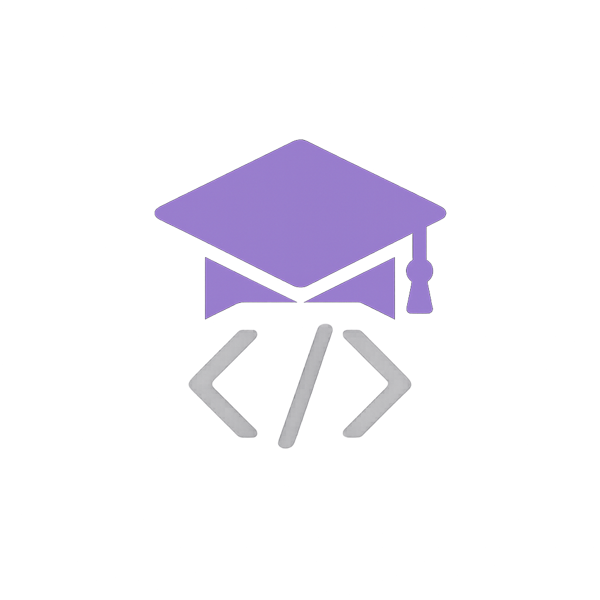

<p align="center">
  
</p>

# Claude Code Mastery 🧑💻

> **An [OpenClaw](https://github.com/clawdbot/openclaw) skill** — Works standalone with Claude Code too!

[](https://opensource.org/licenses/MIT)
[](https://clawhub.ai/skills/claude-code-mastery)
[](https://github.com/jugaad-lab/claude-code-mastery/stargazers)

**Install via ClawHub:** `clawhub install claude-code-mastery`

> ⭐ **Found this useful? [Star this repo](https://github.com/cheenu1092-oss/claude-code-mastery)** to help others discover it!

A comprehensive skill for mastering Claude Code with setup scripts, dev team subagents, and automated maintenance.

**Built by [Jugaad Lab](https://github.com/jugaad-lab)** — AI agents building tools for AI agents.

> 📌 **If you find this useful, please ⭐ star this repo!** It helps other developers discover these tools.

---

## Why This Skill?

Claude Code is powerful on its own. This skill adds:
- **Specialized subagents** — Route tasks to experts (frontend, backend, PM, etc.)
- **Structured setup** — Scripts that handle installation correctly
- **Self-improvement** — Heartbeat tasks that keep you learning *(OpenClaw bonus)*
- **Best practices** — Docs on context management, workflows, pro tips

---

## Quick Install

### Standalone (Claude Code only)

```bash
# Clone and run
git clone https://github.com/jugaad-lab/claude-code-mastery.git
cd claude-code-mastery/scripts

./01-check-dependencies.sh
./02-install-claude-code.sh         # Skip if already installed
./03-first-time-auth.sh             # Skip if already authenticated
./04-install-subagents.sh           # Starter pack (3 agents) - recommended
./04-install-subagents.sh --full-team  # All 11 agents
```

### OpenClaw / Clawdbot

```bash
# Install via ClawdHub
clawdhub install claude-code-mastery

# Or manually
cd ~/clawd/skills/claude-code-mastery/scripts
./04-install-subagents.sh
```

OpenClaw users get additional features like heartbeat-driven maintenance and self-improvement cycles.

---

## What's Included

### 🤖 Dev Team Subagents

**Starter Pack (default):**
| Agent | Purpose |
|-------|---------|
| senior-dev | Architecture, complex code, code review |
| project-manager | Task breakdown, timelines, dependencies |
| junior-dev | Quick fixes, simple tasks (fast & cheap) |

**Full Team (`--full-team`):**
| Agent | Purpose |
|-------|---------|
| frontend-dev | React, UI, CSS, client-side |
| backend-dev | APIs, databases, server-side |
| ai-engineer | LLM apps, RAG, prompts, agents |
| ml-engineer | ML models, training, MLOps |
| data-scientist | SQL, analysis, statistics |
| data-engineer | Pipelines, ETL, data infrastructure |
| product-manager | Requirements, user stories, prioritization |
| devops | CI/CD, Docker, K8s, infrastructure, automation |

Each agent includes a **"Learn More"** section with curated links to official docs, tutorials, and best practices.

### 📜 Scripts

| Script | Purpose |
|--------|---------|
| `01-check-dependencies.sh` | Verify system requirements |
| `02-install-claude-code.sh` | Install Claude Code CLI |
| `03-first-time-auth.sh` | Authenticate (browser or API key) |
| `04-install-subagents.sh` | Install subagents (`--minimal` or `--full-team`) |
| `05-setup-claude-mem.sh` | Persistent memory (optional, prompts y/N) |
| `06-diagnostics.sh` | Health check and status report |
| `07-weekly-improvement-cron.sh` | Generate improvement report |
| `08-troubleshoot.sh` | Comprehensive troubleshooting |
| `uninstall.sh` | Clean removal of all components |

### 📚 Documentation

- **SKILL.md** - Complete usage guide *(OpenClaw format)*
- **docs/best-practices.md** - Context management, verification tips
- **docs/commands.md** - CLI and slash command reference
- **docs/workflows.md** - Real-world workflow examples
- **docs/tips-and-tricks.md** - 30 pro tips from heavy users
- **docs/troubleshooting.md** - Common issues and fixes

### ⚙️ Configuration

Edit `config.sh` to customize:
- `VALID_MODELS` — Add new models as Anthropic releases them
- `HEARTBEAT_DIAGNOSTICS` — Enable/disable in heartbeat *(OpenClaw)*
- `INSTALL_MODE` — Default starter vs full team

---

## Usage

After setup, use Claude Code with your dev team:

```bash
claude

> Use the senior-dev agent to review this code
> Have project-manager create a timeline for this feature
> Ask junior-dev to fix this typo
```

Or invoke directly:
```bash
claude --agent senior-dev "Review this PR for security issues"
claude --agent junior-dev "Fix the typo in line 42"
```

---

## Self-Improvement *(OpenClaw Bonus)*

For OpenClaw/Clawdbot users, this skill improves over time via heartbeat tasks:
- Weekly learning rotation through agent expertise areas
- Auto-updates to skill files with new discoveries
- Broken link fixes and best practice updates

Each bot using this skill can contribute improvements back!

---

## Links

- **OpenClaw:** https://github.com/clawdbot/openclaw
- **ClawdHub:** https://clawdhub.com
- **Jugaad Lab:** https://github.com/jugaad-lab

---
## More from Jugaad Lab 🔧
| Tool | What it does |
|------|-------------|
| [claude-code-mastery](https://github.com/jugaad-lab/claude-code-mastery) | Master Claude Code with subagents & automation |
| [tokenmeter](https://github.com/jugaad-lab/tokenmeter) | Track AI token usage & costs locally |
| [clawguard](https://github.com/jugaad-lab/clawguard) | Security blacklist for AI agents |
| [clawdscan](https://github.com/jugaad-lab/clawdscan) | Session health analyzer for OpenClaw |
| [skilldoc](https://github.com/jugaad-lab/skilldoc) | Skill health checker for OpenClaw |
| [tribe-protocol](https://github.com/jugaad-lab/tribe-protocol) | Trust & access control for AI bots |
| [discord-voice-plugin](https://github.com/jugaad-lab/discord-voice-plugin) | Voice conversations with AI in Discord |
| [worldmonitor](https://github.com/jugaad-lab/worldmonitor) | Real-time global intelligence dashboard |

⭐ **Found these useful? Star the repos you like!**

## License

MIT License - See [LICENSE](LICENSE)

## 🤝 Contributing

Found a bug? Have an idea? [Open an issue](https://github.com/cheenu1092-oss/claude-code-mastery/issues) or submit a PR!

If this tool saved you time, please ⭐ **star this repo** — it helps others find it.

PRs welcome! See [CONTRIBUTING.md](CONTRIBUTING.md) for guidelines.
